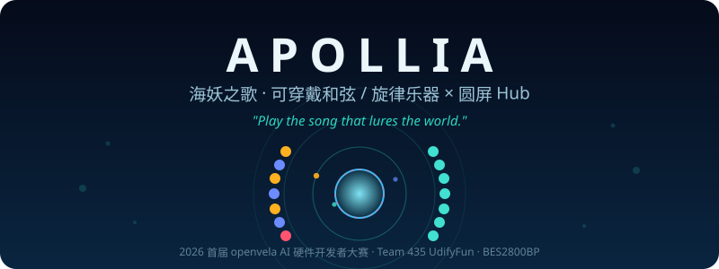
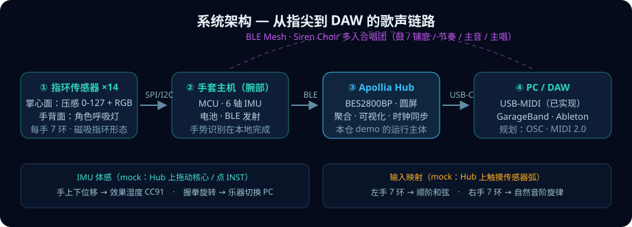
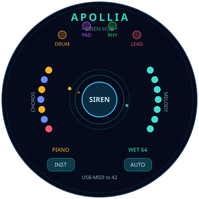
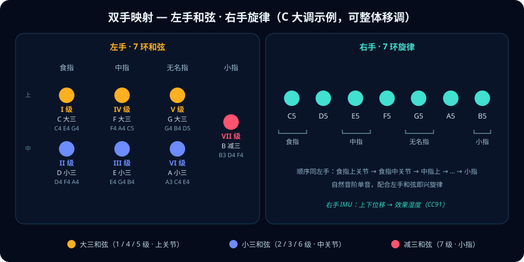

<p align="center">
  
</p>

# Apollia（海妖）— 可穿戴和弦/旋律乐器 × 圆屏 Hub

> **2026 首届 openvela AI 硬件开发者大赛 · 队伍 435 UdifyFun**
>
> *"Play the song that lures the world."* —— 奏响魅惑世界的歌声

**Apollia** 以希腊神话中的海妖 Siren 为魂：双手各戴 7 枚压感指环，**左手低吟和弦、右手高歌旋律**，IMU 手势调制效果器，多人经 BLE 组成「海妖合唱团」。圆屏 **Hub** 是海妖的漩涡——汇聚所有歌声，化作声呐涟漪涌向 DAW。

本仓交付两部分：**完整产品设计**（`docs/apollia_design.md`）+ **可运行的圆屏 Hub demo**（真实 USB-MIDI 输出，开机即玩）。

---

## 一、作品简介

<p align="center">
  
</p>

### Hub demo 实机功能（本仓代码，已在 BES2800BP EVB 圆屏上运行）

<p align="center">
  
</p>

| 屏幕元素 | 表达的能力 |
|---|---|
| 左弧 7 传感器（金=大三 / 靛=小三 / 玫红=减三） | 左手和弦输入，色码即和弦性质 |
| 右弧 7 传感器（青色渐变） | 右手旋律输入 |
| 传感器呼吸光晕 | 手背灯：连接 / 角色状态 |
| 数据流粒子：传感器 → 核心 → DAW 口 | Hub 职能可视化：输入聚合 → 处理 → 输出 |
| 核心声呐涟漪 + 消息脉冲 | 「海妖之歌」实时流量 |
| 顶部 4 角色头像渐次点亮 | 多人合唱团入网（DRUM / PAD / RHY / LEAD） |

### 操作与 MIDI 映射（全部为真实 USB-MIDI 输出）

| 操作 | MIDI 输出 | 对应产品能力 |
|---|---|---|
| 触摸左弧圆点 | 顺阶和弦 NoteOn/Off（ch1） | 左手和弦环 |
| 触摸右弧圆点 | 旋律单音 C5–B5（ch1） | 右手旋律环 |
| **AUTO 按钮** | 自动循环演奏帕赫贝尔《卡农》 | **mock 手套输入**：圆点随旋律点亮、粒子流动 |
| 上下拖动中心核心 | CC91 效果湿度 0–127 | IMU 手上下位移 |
| INST 按钮 | Program Change（钢琴/吉他/弦乐/合成器） | IMU 握拳旋转 |
| 角色头像 | DRUM=ch10 底鼓/军鼓；PAD=Am 和弦；RHY=F4；LEAD=G5 | 多人合唱团各声部 |

> 设计细节（传感器形态、IMU 手势识别、BLE 组网、协议路线）见 **[docs/apollia_design.md](docs/apollia_design.md)**。

## 二、选题方向

**自定方向 · 可穿戴电子乐器**

选择理由：

- 产品形态横跨**硬件**（14 枚压感发光指环 + IMU 手套主机）与**软件**（Hub 可视化 + MIDI/OSC 协议栈 + 多人协同），是对 openvela 全栈能力的完整演练；
- 圆屏 Hub 与手表形态天然同源——BES2800BP EVB 即代表未来 Hub 产品的真实算力与显示规格；
- 演奏交互（和弦/旋律分层、体感调制、多人声部）为 AI 硬件提供了区别于"又一个健康手环"的差异化叙事。

## 三、目录结构

```text
contest2026_435_UdifyFun/
├── .claude/skills/             # 项目沉淀的可复用 Skills（4 个，见 commit）
├── app/apollia_hub/            # ★ 圆屏 Hub demo（本仓核心交付）
│   ├── apollia_hub_main.c      #   UI + 传感器弧 + 粒子 + 自动演奏 + MIDI 输出
│   ├── Kconfig / CMakeLists.txt / Make.defs / Makefile
│   └── tools/uart_midi_bridge.py   # PC 端桥接：串口 → 系统 MIDI 口
├── docs/
│   ├── apollia_design.md       # ★ 完整产品设计方案
│   └── assets/                 # README 插画（SVG）
├── contest2026_435_UdifyFun.xml # manifest：app → packages/demos 软链映射
└── README.md                   # 本文件
```

代码通过 manifest `<linkfile>` 自动软链进编译树（`packages/demos/contest2026_435_apollia_hub`），**生产仓库零改动**。

## 四、运行方式

### 1. 拉取工程

```bash
repo init -u https://github.com/open-vela/contest2026_435_UdifyFun \
  -b dev-ai-contest-2026 -m contest2026_435_UdifyFun.xml
repo sync -c -j8
```

### 2. 编译 AP 固件

板级配套改动（开启 `CONFIG_LVX_USE_DEMO_CONTEST2026_435_APOLLIA_HUB`、rcS 启动 `apollia_hub`）已提交至 vendor_bes 的 `bes1700-apollia-hub` 分支；若使用官方默认配置，手动开启该 CONFIG 后编译：

```bash
./build.sh vendor/bes/boards/best1700_ep/aos_evb/configs/ap --cmake -j8
# 产物: cmake_out/aos_evb_ap/nuttx_ap.bin
```

### 3. 烧录（只烧 AP 即可）

```bash
cd <烧录工具目录>   # 需含 dldtool、programmer1700_dual.bin
./dldtool /dev/ttyUSB0 --reboot programmer1700_dual.bin \
  --set-dual-chip 1 -M nuttx_ap.bin --pgm-rate 2000000
# Windows: dldtool.exe <COM口号> ...；出现 Wait for SYNC 后按板上 RESET
```

### 4. PC 端桥接 + DAW 出声

```bash
pip3 install pyserial python-rtmidi
python3 app/apollia_hub/tools/uart_midi_bridge.py   # 端口自动探测
```

桥接脚本把板子的 MIDI 字节流转成系统虚拟 MIDI 口 **"Apollia UART-MIDI"**（macOS 用 Audio MIDI Setup 验证；DAW 里选它作输入，如 GarageBand 新建 Software Instrument 轨）。

> **为什么是 UART 桥接**：本发布版 BSP 未包含 NuttX USB 设备控制器驱动（DCD），无法做 USB-MIDI class 枚举；Hub 经板载 USB-串口桥输出标准 MIDI 字节流，PC 侧一行脚本还原为真实 MIDI 端口，DAW 体验与 USB-MIDI 等价。桥接脚本自带噪声容错（控制台共线）与 macOS/Linux 端口自动探测。

### 5. 开机即玩

烧录后自动进入 Apollia Hub：

- 点 **AUTO** → 海妖自动唱起《卡农》，传感器圆点随旋律流动、粒子汇入核心、DAW 同步出声
- 手动点任意传感器圆点即时演奏；拖核心调湿度；**INST** 切乐器；点角色头像以声部身份加花

### 双手映射速查

<p align="center">
  
</p>

## 五、AI Coding 使用说明

本作品全程由 AI 结对完成（atman + Claude Code），人负责产品直觉与验收，AI 负责设计落地与工程实现。协作覆盖全部环节：

| 环节 | 协作方式 |
|---|---|
| 需求拆解 | 口述原始想法（指环分布、关节映射、IMU 手势、多人角色），AI 整理为结构化产品设计 `docs/apollia_design.md` |
| 方案设计 | AI 调研平台能力边界（BSP 库模式限制、蓝牙/USB 链路可用性），给出 UART-MIDI 等务实替代方案并论证取舍 |
| 编码 | AI 实现 Hub 全部代码（1080 行 LVGL C + Python 桥接），人验收交互效果 |
| 调试 | 人报告现象（点击 crash / 圆环不对称 / 文字被圆屏裁切），AI 定位根因并修复——含 LVGL 动画回调签名类型双关、坐标缓存时序、圆屏安全区布局三类典型坑 |
| 文档 | README、设计文档、本说明均由 AI 起草，人审定 |

调试过程的价值尤为突出：每一次现场问题都由"现象 → 假设 → 源码/反汇编取证 → 修复 → 回归验证"闭环完成，root cause 均落到了具体代码行。完整对话日志见 `logs/` 目录（按《AI Coding 日志归集与提交手册》导出提交）。

## 六、后续路线

| 阶段 | 内容 |
|---|---|
| 近期 | 真实指环传感器输入（BLE 接入 Hub）；IMU 手势实装 |
| 中期 | 内置合成器（HiFi4 DSP 脱机演奏）；OSC 输出控制 Ableton / 调音台 |
| 远期 | BLE MIDI 直连；MIDI 2.0；Siren Choir 多人实机联奏 |

---

<div align="center">
  <sub>Team 435 UdifyFun · 2026 openvela AI 硬件开发者大赛 · 基于 BES2800BP (best1700_ep AOS EVB)</sub>
</div>
